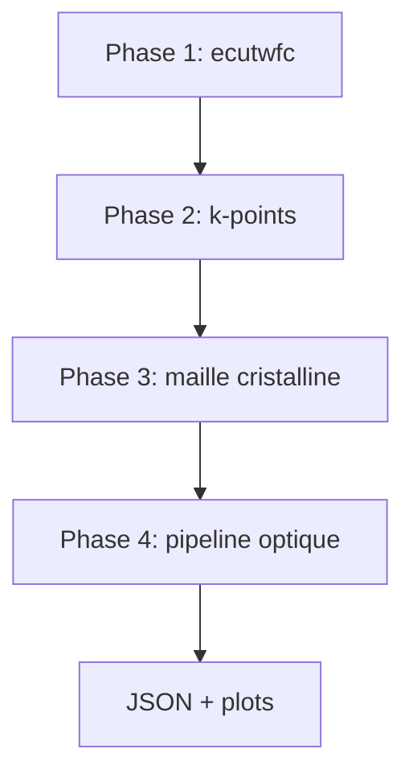

# Gestionnaire de convergence

Le module `convergence_manager.py` automatise l'optimisation des paramètres de calcul QE avant le pipeline optique. Il utilise une approche **template-based** : les fichiers d'entrée sont régénérés à chaque itération plutôt que modifiés par regex.

## Les 4 phases



### Phase 1 — Convergence de l'énergie de coupure

- Balaye `ecutwfc` de 30 à 120 Ry (pas de 10)
- Critère : variation d'énergie totale < seuil
- Produit : `ecutwfc` optimal pour les phases suivantes

### Phase 2 — Convergence des k-points

- Grilles progressives : 4×4×4 → 6×6×6 → … → 12×12×12
- Le `kpoint_predictor.py` peut suggérer une grille initiale adaptée
- Critère : convergence de l'énergie ou du gap

### Phase 3 — Optimisation de la maille

- Balaye la constante de maille autour de la valeur Materials Project (±5 %)
- Important pour les propriétés diélectriques sensibles à la compression

### Phase 4 — Pipeline optique

1. SCF optique avec paramètres convergés
2. NSCF sur grille k dense
3. `epsilon.x` → `epsilon_out/<matériau>_epsr.dat`
4. Parsing et export JSON

## Sécurités intégrées

| Mécanisme | Description |
|-----------|-------------|
| Suppression des `.out` obsolètes | Évite de lire des énergies périmées |
| Safety check ΔE = 0 | Détecte les inputs non mis à jour |
| Template `QEInputTemplate` | Génération fiable des `.in` sans regex fragiles |

## Données de convergence

Les traces sont sauvegardées dans `convergence_data/<matériau>_convergence.json` et visualisables :

```bash
python3 plot_convergence_progressive.py convergence_data/Si_convergence.json
```

## Voir aussi

- [Optimisation](/docs/setup/optimization)
- [Erreurs — Convergence](/docs/setup/troubleshooting#convergence)
