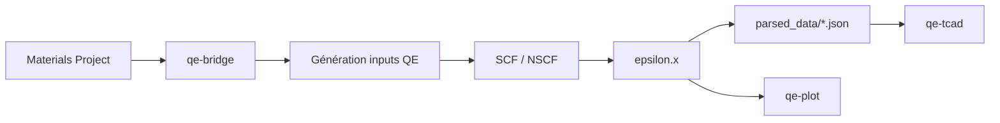

# Bienvenue sur QE-to-TCAD

**QE-to-TCAD** est un pipeline qui transforme les simulations quantiques **Quantum ESPRESSO** en données exploitables pour les simulateurs de dispositifs **TCAD** (Technology Computer-Aided Design).

## Pourquoi ce projet ?

Les ingénieurs et chercheurs en microélectronique ont besoin de propriétés matériaux précises — constante diélectrique, gap de bande, masses effectives — pour simuler des dispositifs. Obtenir ces données depuis la DFT (Density Functional Theory) avec Quantum ESPRESSO implique habituellement :

- Télécharger manuellement structures et pseudopotentiels
- Rédiger et ajuster des fichiers d'entrée `.in`
- Lancer SCF, NSCF et `epsilon.x` séparément
- Vérifier la convergence (ecut, k-points, maille)
- Parser les sorties et formater pour TCAD

**QE-to-TCAD automatise l'ensemble de ce flux** et garantit la cohérence physique des résultats.

## Pour qui ?

- **Chercheurs en science des matériaux** souhaitant extraire ε(ω) depuis la DFT
- **Ingénieurs dispositifs** préparant des modèles pour Sentaurus, Silvaco ou DEVSIM
- **Utilisateurs Quantum ESPRESSO** cherchant un workflow reproductible QE → TCAD

## Ce que vous obtenez

| Livrable | Description |
|----------|-------------|
| **JSON TCAD-ready** | Bandgap, masses effectives, ε₀, ω_p dans `parsed_data/` |
| **Plots 300 DPI** | Courbes de dispersion diélectrique publication-ready |
| **Convergence automatisée** | ecut, k-points et maille optimisés automatiquement |
| **Recovery** | Reprise après interruption de calcul |

## Quick Start

```bash
# 1. Installer (PyPI)
pip install 'qe-to-tcad[tcad]'

# 2. Clé API Materials Project (obligatoire — créez la vôtre)
# Linux / macOS :
export MP_API_KEY="votre_cle_32_caracteres"
# Windows PowerShell : $env:MP_API_KEY="votre_cle_32_caracteres"

# 3. Pipeline + plot + validation TCAD
qe-bridge SiGe
qe-plot SiGe
qe-tcad SiGe diode
```

## Flux global



## Prochaines étapes

- [Installation](/docs/setup/installation) — configurer Python, QE et MPI
- [Utilisation](/docs/setup/usage) — lancer votre premier calcul
- [Architecture](/docs/architecture/overview) — comprendre le pipeline en détail
