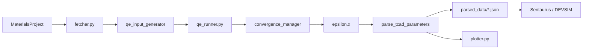

# Pipeline architecture

The APE Bridge orchestrates a complete workflow from the **Materials Project database** to **TCAD export**, via Quantum ESPRESSO.

## Data flow

## Main steps

### 1. Structure acquisition

- Query the **Materials Project** API by chemical formula (`Si`, `C`, `Ge`…)
- Download the most stable crystal structure (CIF/POSCAR)
- Auto-download **ONCV-PBE** pseudopotentials (SG15 library)

### 2. QE input generation

The `qe_input_generator.py` module produces `.in` files for:
- SCF calculation (self-consistency)
- NSCF calculation (bands on dense k-grid)
- `epsilon.x` calculation (dielectric function)

### 3. Execution and convergence

`qe_runner.py` runs `pw.x` and `epsilon.x` with MPI. `convergence_manager.py` automatically optimizes ecut, k-points and lattice.

### 4. Extraction and export

`parse_tcad_parameters.py` parses QE outputs and produces structured JSON in `parsed_data/`.

### 5. Visualization

`plotter.py` and `plot_convergence.py` generate terminal and 300 DPI PNG figures.

## Entry points

| Command | Role |
|---------|------|
| `qe-bridge <formula>` | Full pipeline (recommended) |
| `python3 fetcher.py <formula>` | Direct orchestrator |
| `python3 convergence_manager.py` | Convergence only |
| `python3 qe_runner.py <file.in>` | Low-level QE execution |

## See also

- [Physics](/docs/architecture/physics)
- [Convergence manager](/docs/architecture/convergence)
- [Project modules](/docs/architecture/modules)
