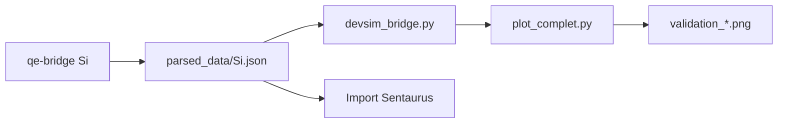

# Intégration TCAD

The APE Bridge exporte des propriétés matériaux dans un format JSON directement exploitable par les simulateurs de dispositifs.

## Simulateurs cibles

| Simulateur | Format | Usage |
|------------|--------|-------|
| **Sentaurus Device** (Synopsys) | JSON / tables matériau | Import propriétés diélectriques et transport |
| **Silvaco ATLAS** | JSON | Base de données matériau |
| **DEVSIM** | `*_device_bridge.json` | Validation 1D open-source |

## Export JSON standard

```python
from fetcher import MaterialAnalyzer

analyzer = MaterialAnalyzer("Si")
data = analyzer.export_for_tcad()

import json
with open("Si_for_TCAD.json", "w") as f:
    json.dump(data, f, indent=2)
```

Champs clés pour TCAD :
- `bandgap_ev`, `dielectric_constant`
- `hole_effective_mass`, `electron_effective_mass`
- `nc_cm3`, `nv_cm3` (densités effectives de bande)
- `epsilon_static`, `plasma_frequency_eV`, `epsr_x/y/z` (optique)

## Bridge DEVSIM

Le module `devsim_bridge.py` convertit le JSON électronique en paramètres pour DEVSIM :

```python
from devsim_bridge import DeviceSimulator

sim = DeviceSimulator("parsed_data/Si_device_bridge.json")
sim.run_diode()
```

### Validation diode 1D

```bash
python3 plot_complet.py parsed_data/SiGe.json diode
# Sortie: validation_diode_SiGe.png
```

### Validation transistor 1D

```bash
python3 plot_complet.py parsed_data/SiGe.json transistor
# Sortie: validation_transistor_SiGe.png
```

Les modes `diode` et `transistor` partagent le même point d'entrée mais avec maillages, dopages et tensions adaptés.

## Benchmark SRH

Test de recombinaison Shockley-Read-Hall sur une diode :

```bash
python3 test_srh_diode.py
# Sortie: test_srh_result.png
```

## Analyse C(V)

```bash
python3 devsim_cv_ac.py
```

## Workflow recommandé



## Voir aussi

- [Formats de données](/docs/architecture/data-formats)
- [Utilisation](/docs/setup/usage)
