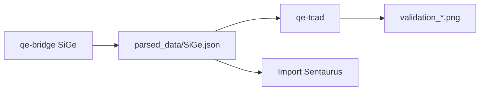

# TCAD integration

QE-to-TCAD exports material properties in a JSON format that device simulators can consume directly.

## Target simulators

| Simulator | Format | Usage |
|-----------|--------|-------|
| **Sentaurus Device** (Synopsys) | JSON / material tables | Import dielectric and transport properties |
| **Silvaco ATLAS** | JSON | Material database |
| **DEVSIM** | `*_device_bridge.json` | Open-source 1D validation |

## Standard JSON export

```python
from fetcher import MaterialAnalyzer

analyzer = MaterialAnalyzer("Si")
data = analyzer.export_for_tcad()

import json
with open("Si_for_TCAD.json", "w") as f:
    json.dump(data, f, indent=2)
```

Key fields for TCAD:
- `bandgap_ev`, `dielectric_constant`
- `hole_effective_mass`, `electron_effective_mass`
- `nc_cm3`, `nv_cm3` (effective density of states)
- `epsilon_static`, `plasma_frequency_eV`, `epsr_x/y/z` (optics)

## DEVSIM bridge

The `devsim_bridge.py` module converts electronic JSON into DEVSIM parameters:

```python
from devsim_bridge import DeviceSimulator

sim = DeviceSimulator("parsed_data/Si_device_bridge.json")
sim.run_diode()
```

### Diode / transistor validation (recommended)

```bash
qe-tcad SiGe diode
qe-tcad SiGe transistor
```

### Advanced scripts (source repository)

```bash
python3 plot_complet.py parsed_data/SiGe.json diode
# Output: validation_diode_SiGe.png

python3 plot_complet.py parsed_data/SiGe.json transistor
# Output: validation_transistor_SiGe.png
```

The `diode` and `transistor` modes share the same entry point but use adapted meshes, doping and bias.

## SRH benchmark

Shockley-Read-Hall recombination test on a diode:

```bash
python3 test_srh_diode.py
# Output: test_srh_result.png
```

## C(V) analysis

```bash
python3 devsim_cv_ac.py
```

## Recommended workflow



## See also

- [Data formats](/docs/architecture/data-formats)
- [Usage](/docs/setup/usage)
