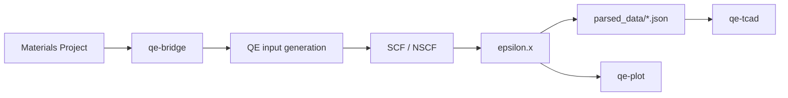

# Welcome to The APE Bridge

**The APE Bridge** (Automated Pipeline for Extracting dielectric properties) is a pipeline that transforms **Quantum ESPRESSO** quantum simulations into data usable by **TCAD** (Technology Computer-Aided Design) device simulators.

## Why this project?

Device engineers and materials researchers need accurate material properties — dielectric constant, band gap, effective masses — to simulate devices. Obtaining these from DFT with Quantum ESPRESSO typically requires:

- Manually downloading structures and pseudopotentials
- Writing and tuning `.in` input files
- Running SCF, NSCF and `epsilon.x` separately
- Checking convergence (ecut, k-points, lattice)
- Parsing outputs and formatting for TCAD

**The APE Bridge automates this entire workflow** and ensures physical consistency of results.

## Who is it for?

- **Materials science researchers** extracting ε(ω) from DFT
- **Device engineers** preparing models for Sentaurus, Silvaco or DEVSIM
- **Quantum ESPRESSO users** looking for a reproducible QE → TCAD workflow

## What you get

| Deliverable | Description |
|-------------|-------------|
| **TCAD-ready JSON** | Band gap, effective masses, ε₀, ω_p in `parsed_data/` |
| **300 DPI plots** | Publication-ready dielectric dispersion curves |
| **Automated convergence** | ecut, k-points and lattice optimized automatically |
| **Recovery** | Resume after calculation interruption |

## Quick Start

```bash
# 1. Install (PyPI)
pip install 'qe-to-tcad[tcad]'

# 2. Materials Project API key (required — create your own)
# Linux / macOS:
export MP_API_KEY="your_32_character_key"
# Windows PowerShell: $env:MP_API_KEY="your_32_character_key"

# 3. Pipeline + plot + TCAD validation
qe-bridge SiGe
qe-plot SiGe
qe-tcad SiGe diode
```

## Global workflow



## Next steps

- [Installation](/docs/setup/installation) — configure Python, QE and MPI
- [Usage](/docs/setup/usage) — run your first calculation
- [Architecture](/docs/architecture/overview) — understand the pipeline in detail
